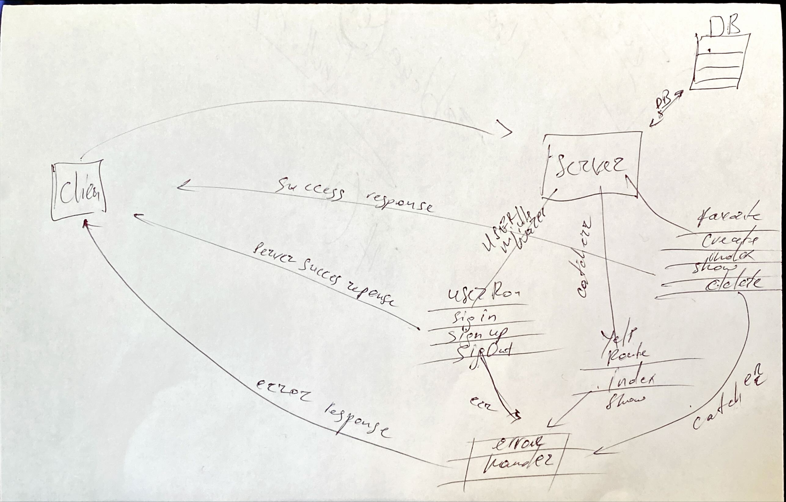

# place-finder-server

### Link to HEROKU
  - deployed &nbsp; &nbsp; `https://git.heroku.com/place-finder-server.git` 

- running at &nbsp; &nbsp; ` https://place-finder-server.herokuapp.com/ `

### About
Place Finder server has been used and built by express library as a backend API. Server are getting requests and checks user token and chech/handle validations and sends responses. User, Yelp, Business and Reviews modals/routes are controls response. 

### Frameworks and NPM packages used

- express js
- axios
- bcrypt
- cors
- express-async-handler
- mongodb
 - mongoose
- passport
- passport-http-bearer

### ERD
- 
